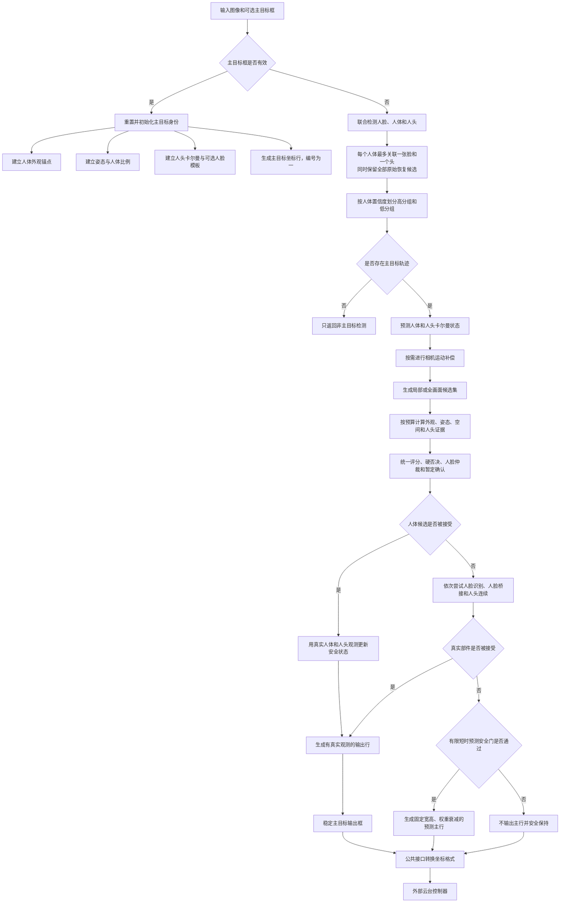
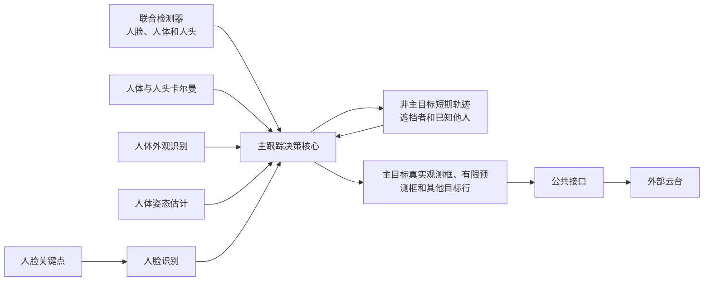
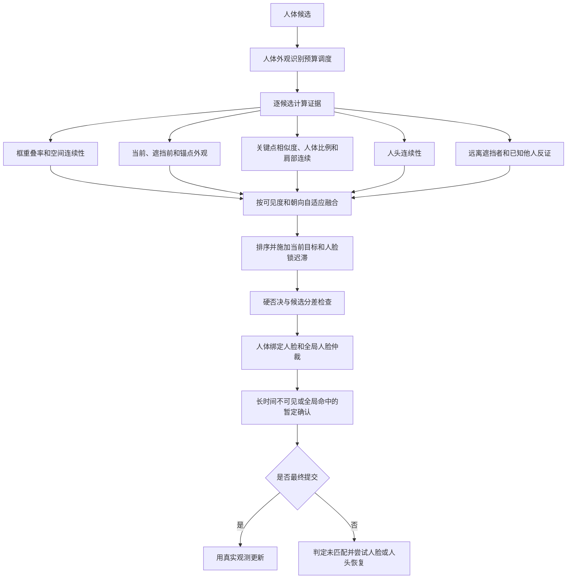
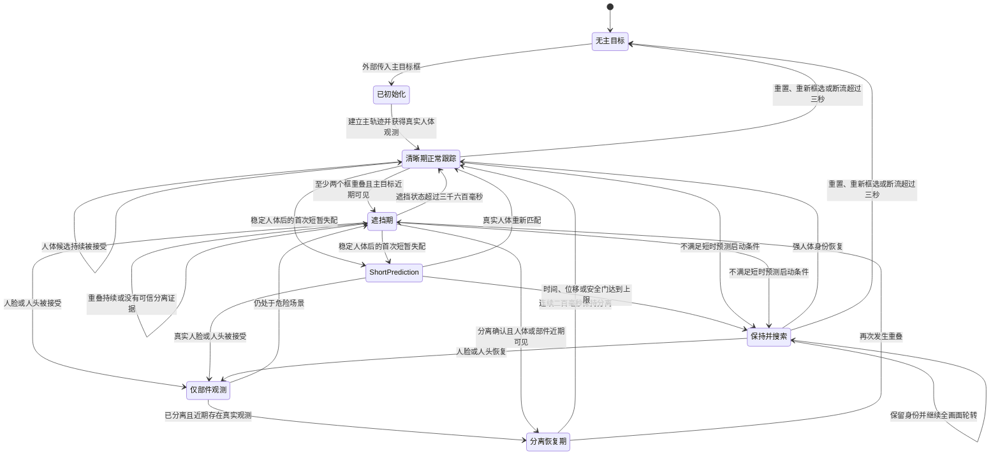
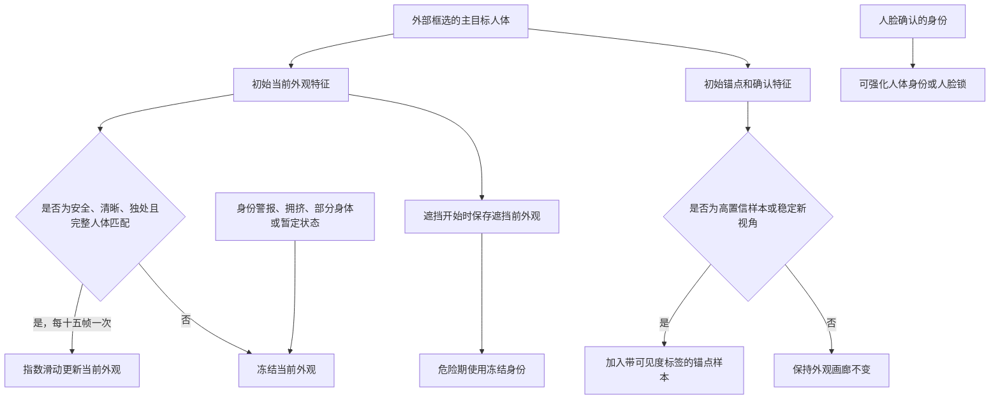
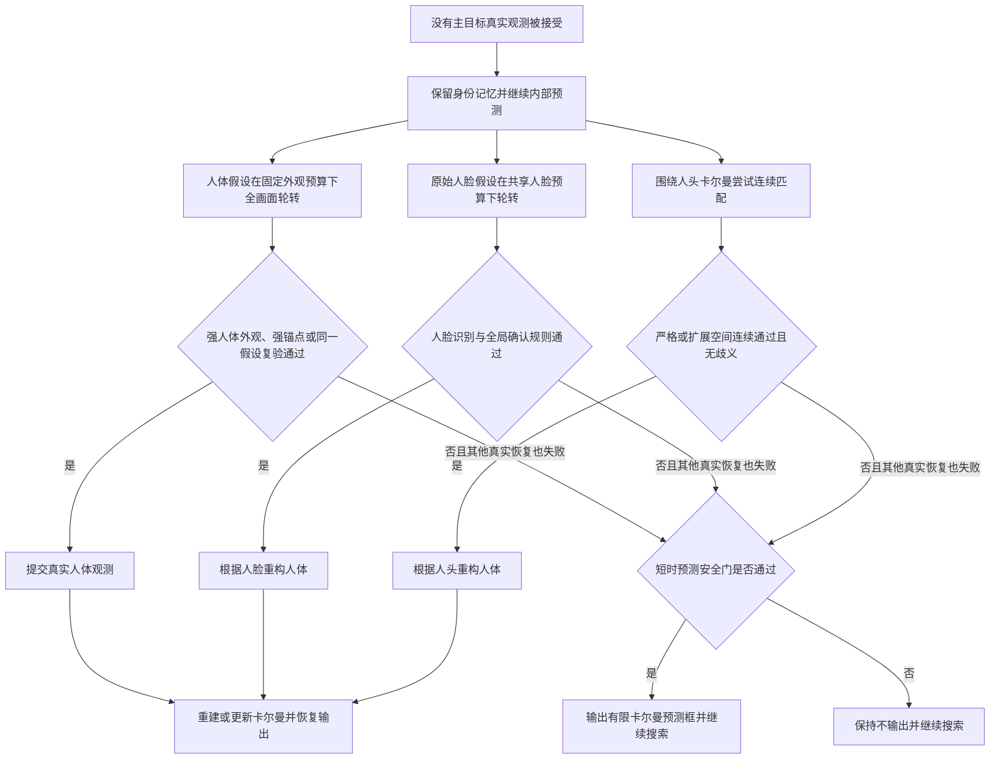
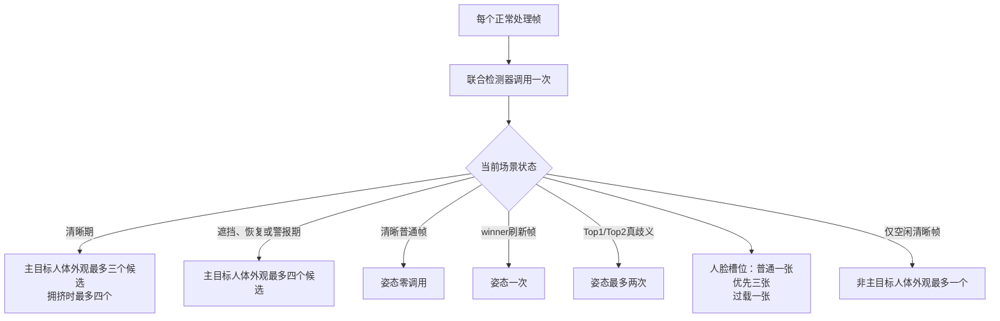

# PTZ 单目标人物跟踪算法——技术设计

> 面向算法、计算机视觉与嵌入式 AI 工程师。本文描述**当前仓库真实实现**，不是理想化方案或历史设计稿。
>
> 事实标记：**[已实现]** 表示源码可直接确认；**[设计依据]** 表示可由源码注释或项目规范确认；**[工程解读]** 表示对现有机制的解释；**[UNKNOWN]** 表示当前仓库无法确认。

## 1. Executive Summary

这是一个运行在 Ascend NPU 边缘设备上的 PTZ 单主目标人物跟踪库。应用先框选一个人，核心随后在每帧检测到的身体、头部和人脸中寻找同一人，返回 `[x1,y1,x2,y2,id]` 主框；C API 再转换为 `x,y,w,h`，供仓库外部的云台控制器消费。

它不是完整 MOT：系统只为一个主目标维护长期身份记忆，同时短期维护最多 8 条非主轨迹，作为遮挡者、共存他人和负身份证据。这样把有限的 ReID、Pose 和人脸推理预算集中在“不要跟错主目标”上。

算法的中心不是某一种分数，而是四类证据的受控协作：

- **检测**回答“画面里有什么”，不回答“是谁”。
- **运动与空间**回答“从上一位置能否合理到这里”，但 PTZ 运动、遮挡和交叉会破坏其可靠性。
- **ReID 与外观锚点**提供身体身份信息，但半身、背身、遮挡和同衣会使分布重叠。
- **人脸**是更强的身份直证，但仅在脸足够大、角度和质量合格且推理预算轮到时可用；**Pose**主要提供可见度、人体结构、OKS 和肩部连续性，不改变 ReID crop。

安全优先级是“错误跟随比短时停止更危险”。因此危险期存在 anchor veto、竞争分差、已知他人排除、暂定确认和特征冻结。为避免稳定跟踪刚进入完全遮挡时立刻刹停，当前版本在 BODY/HEAD/FACE 都失败后增加了严格受限的 `PREDICTED` 输出：只从稳定 BODY 的首次 miss 启动，最多 400 ms、限制中心位移并衰减控制权重；它只服务 PTZ 连续性，绝不代表身份确认或真实 measurement。

Implementation:

- `LightTracker.cpp` — `LightTracker::update()`、`match_main_target_unified()`
- `KalmanBoxTracker.cpp` — `predict()`、`update()`、`predict_head()`、`correct_body_from_part()`
- `c_api/fx_tracker.cpp` — `fx_tracker_run()`

## 2. 问题定义与边界

### 2.1 要解决的问题

输入是一帧 BGR 图像和可选的外部主目标框。系统需要：

1. 在正常移动、多人接近、穿行、局部遮挡和身体漏检时持续定位指定的人；
2. 身体不可见但头或脸可见时，仍能返回适合 PTZ 的人体语义框；
3. 主目标重新出现在远处或人群另一侧时，依靠身体 ReID 或人脸恢复；
4. 在 NPU 推理预算有限的情况下，优先降低 ID switch 和 wrong follow；
5. 输出稳定、可被云台消费的框，而不是把内部所有候选或预测都当作主目标。

仓库本身不包含 PTZ 电机控制器。它提供目标框、主目标权重，以及 C++ 层的 aim point 查询；实际 PID、构图模式、速度限制和串口协议均为 **UNKNOWN**。

### 2.2 为什么普通固定相机跟踪不够

固定相机中，目标图像位移大体来自人物运动；PTZ 中则是：

```text
观测到的图像位移 = 人物真实运动 + 相机转动造成的背景/目标反向位移
```

因此纯 IoU 或匀速 Kalman 会把相机运动误认为人物运动；云台又根据输出继续转动，形成闭环。多人交叉时，离预测位置最近的人可能只是遮挡者；若立即更新外观模板，错误会自我强化。当前设计把运动作为“先验和 gate”，把身份作为“确认和否决”，并在危险期降低对位置的盲信。

### 2.3 当前能力边界

- 主目标必须由外部 `main_target`/`mainBox` 指定；没有自动从候选中选择主目标的流程。
- 主目标身份不会因长时间未匹配自动清除；它一直保留到显式 reset、重新框选，或输入断流超过 3 秒触发 reset。
- 无任何真实身体、头或脸观测时，仅稳定 BODY 后的短时安全窗口可输出 prediction；不满足条件或到达上限后不输出主框。
- GMC 和自运动前馈代码存在，但默认均关闭。
- 实际目标硬件、输入分辨率、端到端 FPS、准确率与回放指标在仓库中没有可复现实验，均为 **UNKNOWN**。

## 3. Requirements & Constraints

### 3.1 技术与部署约束

**[已实现]** 技术栈为 C++17、OpenCV 4、Huawei Ascend ACL 与离线 `.om` 模型。模型从 `/oem/model` 加载；任一模型缺失或初始化失败都会令 `LightTracker::init()` 失败。

加载的模型：

| 模型 | 文件 | 当前职责 |
|---|---|---|
| 联合检测器 | `v8n_face_body_head_full_body.om` | 一次检测 face/body/head，当前代码按标签 0/1/2 解释 |
| Person ReID | `mobilev2_EmbeddingHead_reid_v1_GeMP_pre.om` | 完整 detection ROI 的身体外观特征 |
| Pose | `rtmpose-t.om` | 单候选 192×256 Topdown Pose；按需提供可见度、OKS、结构比例、肩部信息 |
| Face KPS | `faceKps_v7_01.om` | 106 点关键点，抽取 5 点用于质量/姿态/对齐 |
| Face Reco | `faceReco_v2.om` | 对齐脸特征与主目标脸模板比对 |

Implementation: `LightTracker.cpp` — `init()`；各模型的 `init()/run()`。

### 3.2 安全约束

**[设计依据]** 项目遵循：

```text
Wrong Follow > Temporary Lost
```

也就是，错误持续驱动云台朝另一个人运动，通常比短时间没有主框更危险。它体现在：

- 遮挡/拥挤期提高身份要求，而不是只取最高总分；
- anchor 过低、与已知他人更相似、竞争者分差不足时拒绝候选；
- 远距离全图恢复通常需要强 ReID、人脸或跨帧确认；
- 遮挡、警报、邻人存在、部分身体时冻结主外观 EMA；
- 纯预测不冒充 measurement、不更新身份，只能在有限窗口以衰减权重驱动 PTZ。

### 3.3 性能约束

检测每个正常 tracking 帧固定调用一次，但 ReID、Pose、Face 都按场景调度。系统避免对所有人每帧运行所有模型：

- 主人体 ReID：CLEAR 通常最多 3 个候选；危险期最多 4 个；拥挤 CLEAR 可到 4 个。
- Pose：CLEAR 普通帧 0 次，每 3 帧对已确认 winner refresh 1 次；真实 Top1/Top2 ambiguity 最多 2 次；OCCLUDED 默认 0 次，任意帧硬上限 2。
- Face：普通帧 1 个“FaceKps+FaceReco”槽，人脸优先帧 3 个，过载时 1 个。
- 非主 ReID：仅空闲 CLEAR 帧最多 1 条，且不抢 Pose、周期人脸、危险期和全图主搜索。

这些是调用预算，不是准确的耗时上界；模型在目标设备上的时间与并发行为是 **UNKNOWN**。

## 4. Core Design Philosophy

### 4.1 一个长期身份中心，多个短期反证对象

**[已实现]** 主目标拥有完整身份状态：当前 ReID、不可变/分带 anchor gallery、Pose、头部 KF、人脸模板、质量历史和遮挡状态。非主目标只维护轻量 KF、短期共存信息、可选 ReID/Pose，主要用于回答“这个候选是否其实是已知他人”。

这不是全局 ID 一致的 MOT。收益是把算力和复杂身份决策集中在主目标；代价是非主 ID 可能在交叉中互换，且主目标身份必须由外部初始化。

### 4.2 身份、位置和时间各自回答不同问题

| 信息 | 回答的问题 | 单独使用的失败方式 |
|---|---|---|
| Detection | 哪里有 body/head/face | 没有跨帧身份 |
| IoU/中心距 | 是否空间连续 | 交叉时容易选遮挡者；PTZ 运动会令预测滞后 |
| Body/Head Kalman | 下一帧大致在哪里 | 只能延续运动，不能证明是谁；长遮挡会漂移 |
| ReID | 外观像不像主目标 | 同衣、半身、背身、遮挡、尺度变化会混淆 |
| Face | 脸是不是主目标 | 小脸、侧脸、背脸、漏检和预算不足时不可用 |
| Pose | 姿态/结构/可见度是否相容 | 关键点不是强身份；遮挡时也会退化 |
| 时间一致性 | 同一假设能否连续成立 | 会增加恢复延迟，不能修复错误证据本身 |

**[工程解读]** 匹配不是“把所有分数相加即可”，而是“软评分负责排序，硬门负责安全，强身份可有限绕过不可靠空间”。

### 4.3 Measurement、Prediction 和 Reconstruction 必须分开

- **Measurement**：真实 body/head/face detection，经匹配或识别接受。
- **Prediction**：body/head Kalman 的内部预测，只用于候选搜索和连续性判断。
- **Reconstruction**：由已接受的头或脸，依据学习到的头/脸到人体比例构造可输出人体框。

重构框会弱校正 body KF，但不会重置 body 的 `time_since_update`、hit 或 `last_observation`，因此不会伪装成真实人体 detection。纯 prediction 可作为 PTZ-only 主行输出，但不刷新真实观测时钟、KF measurement、身份 feature 或状态机。

## 5. System Overview



### 5.1 模块协作



历史 `Association.*`、`MainTargetPredictor.*` 和 `GaitRecognition.*` 没有被 `LightTracker` include、持有或调用，现已从维护源码和构建命令删除。

## 6. End-to-End Pipeline

### 6.1 帧入口与时间状态

`LightTracker::update()` 首先计算单调时钟帧间隔。正常值驱动 Kalman 的 `dt`；异常或首帧回退 40 ms。断流超过 3 秒会 `reset()`，清除主目标、模板、轨迹、状态机和恢复假设。

随后更新：

- ID-switch alert 的 3600 ms 自动超时；
- 过载迟滞：连续 3 帧 `dt>250 ms` 进入，连续 5 帧 `dt<150 ms` 退出；
- 本帧 Face/Pose/secondary-ReID 预算；
- 可选 ego soft-reference 前馈，默认关闭。

### 6.2 外部主目标初始化

若 `mainBox.area()>0`，当前帧不走普通关联，而调用 `setMainTarget()`：

1. 全量 reset；把外部框视为真实 BODY measurement；
2. 对完整框提取 ReID，创建 main `KalmanBoxTracker`，建立 current/anchor/confirmed embedding；
3. 对已确认的指定 BODY 运行一次 RTMPose，注册关键点和人体比例；
4. 在主框 ROI 内再运行一次联合检测器，选择最高分头和几何一致的脸；
5. 若头存在则初始化独立 head KF，并在可靠几何下学习 head-to-body 比例；
6. 若脸唯一、尺寸和质量合格，则 FaceKps+FaceReco 注册模板；否则交给后续延迟注册；
7. 立即返回主框 `id=1`、权重 1。

这里没有“候选连续数帧自动转主目标”。主目标选择权属于应用。

### 6.3 一次联合检测与部件关联

普通帧只调用一次 `Detector_yolox`，阈值 0.20，得到原始 face/body/head。Detector 将全图等比缩放到 416 输入的左上角，右侧/底部填充 114；ACL 推理后按 `[1,3549,8]`、stride 8/16/32 解码并做分类别 NMS，再把结果映射回原图。模型文件先由 `Utils::loadModel()` 读入内存，再交给各模块的 `ModelProcess` 创建 ACL model/input/output 资源。`matchPersonFaces()`：

- 先把**所有原始脸和头**存入 recovery pool，避免它们被人体关联结果吞掉；
- 只有 body score `>0.30` 才能拥有部件；低于后续人体阈值的框不会永久吞脸；
- 每个人体最多关联一张脸和一个头；脸要求位于人体上部且水平居中，多个时按几何代价和分数选；
- 未关联头/脸进入 standalone pool；即使某张脸因人体几何异常未成为 standalone，它仍保留在 raw recovery pool，可被全局 face-only 识别。

随后 `extract_detections()` 把人体分为：

- `dets_one`：score `>0.70`；
- `dets_second`：score `>0.30` 且未进入高分组。

这两个组当前不是完整 ByteTrack 的两阶段关联，而是统一匹配中的置信度来源和索引空间。C++ `update()` 返回的 `person_cnt` 是两组人体数量之和；C API 当前没有暴露该字段。

### 6.4 Prediction、候选生成与全图搜索

有 main tracker 时，`assign_cascade()` 先调用 `get_predicted_tracks()`：

- 根据真实帧间隔配置 body/head KF；
- 每条轨迹执行 `predict()`，主目标同时执行 `predict_head()`；
- 长盲超过 1500 ms 时速度已冻结，但状态仍继续推进；
- 数值非法时恢复快照或用最后可靠 observation 重建。

若 GMC 开启，上一帧到当前帧的背景仿射会作用于预测框、软参考点及所有 KF 状态；默认关闭。

`collect_nearby_dets()` 同时生成：

- `match_candidates`：按可信中心距离排序、位于动态半径内的局部候选；
- `all_candidates`：全画面人体候选；
- `close_det_count`：紧邻人数，用于拥挤判断和模板保护；
- `overlap_count`：与主预测/近期观测 IoU `>0.25` 的人数，用于遮挡状态。

动态局部门在短 miss 时约 4 个主框对角线，较长 miss 时约 6 个，之后全图。只要进入危险、警报、BODY 上帧已 miss、盲时长 `>=500 ms`，或画面拥挤，统一匹配就使用 `all_candidates`。全图扩大的是**可轮转集合**，不会突破本帧 ReID 预算。

### 6.5 预算化身份计算

全图人体候选被关联到寿命 8 帧的 `BodyReidHypothesis`。每帧 ReID 调度兼顾：

1. 局部利用：预测/可信搜索中心附近候选；
2. 待确认假设：上一帧 provisional 的对象；
3. 公平探索：按“最久未扫描”，同龄时从最后可信位置由近到远分环轮转。

因此远处候选不会因距离永远失去资格，但短暂出现的远处人仍可能在预算轮到前消失。

### 6.6 统一匹配与提交

`match_main_target_unified()` 是核心决策函数。它不是 Hungarian assignment，而是围绕唯一 main tracker 对候选进行：



候选软信号包括预测 IoU、ReID、anchor、Pose OKS、人体比例、肩部连续性、头部匹配、远离遮挡者。权重根据 `CLEAR/OCCLUDED/RECOVERING`、可见度和朝向动态变化。例如上半身或 HEAD_ONLY 时降低身体 ReID/shape/OKS，提升头部连续性；ReID 前两名接近时降低 appearance 权重，避免把一个不具区分力的分数当强证据。

软排序之后仍需通过硬门：anchor veto、已知他人排除、头部否决、空间异常、总分歧义、分离轨迹约束、OCC commit gate，以及长盲/全局命中的 provisional gate。一个总分最高但身份不够强的候选可以被拒绝。

### 6.7 更新、恢复与输出

若 BODY 最终提交：

- body KF 用真实检测更新；head KF 仅在相应头观测可信时更新；
- 安全条件下更新 current embedding 或 anchor gallery；
- 更新可见度、几何比例、质量监控、搜索锚点；
- 更新最多 8 条 secondary tracks；
- 可能执行延迟人脸注册；
- `generate_final_results()` 只输出 `time_since_update<1` 的真实观测轨迹。

若 BODY 未提交，则依次尝试：

1. raw-face FaceReco 恢复；
2. 上一帧已 FaceReco 确认的人脸物理连续桥接；
3. head KF 空间连续性；
4. 都失败后检查短时 prediction 安全门；通过则返回衰减权重的 `id=1`，否则 HOLD。

BODY/HEAD/FACE 输出在 `update()` 尾部经过 `stabilize_returned_box()`；其他 detection 由 `add_other_det()` 追加。C API 最多复制 5 行。

## 7. Main Target Lifecycle

当前代码只有遮挡 enum，没有完整的 `TRACKED/LOST/SEARCH` enum。下图是对真实条件分支的**逻辑状态归纳**，不是新增实现。



### 7.1 No Main

没有 main tracker 时，检测仍运行，`dets_one/dets_second` 会作为 id 900+ 的展示框返回，但系统不会自主认领任何人为主目标。

### 7.2 Initialized

外部框直接建立 main identity。初始 ReID 必做；Pose 尝试建立身体比例；head/face 能否建立取决于检测、几何、尺寸、角度和质量。人脸注册失败不影响 BODY 初始化，但后续 face recovery 将不可用，直到延迟注册成功。

### 7.3 Clear Tracked

每帧仍执行身份匹配，不把连续位置直接等同身份。独处、完整可见、无警报时允许缓慢适应 current embedding 和补充新视角 anchor；在人群中则冻结。

### 7.4 Occluded / Recovering

`CLEAR -> OCCLUDED` 需要 overlap `>=2`，且 main BODY 最近 `tsu<=2`、真实观测盲时长 `<=300 ms`。进入时保存 pre-occlusion embedding、运动方向和最可能遮挡者。

退出 OCC 不能只看 overlap 下降，因为主目标完全消失时只剩遮挡者也会令 overlap 从 2 降到 1。代码还要求 BODY 最近匹配，或 350 ms 内有已接受头/脸 observation；满足分离 1 帧后进入 `RECOVERING`。RECOVERING 无重叠 200 ms 回 CLEAR，再次重叠则回 OCC。

OCC 超过 3600 ms会强制回 CLEAR，但这只改变风险门和调度，不清除主身份。

### 7.5 Hold/Search 与“真正 Lost”

没有 BODY/FACE/HEAD 时：

- body/head KF 继续 predict；
- `last_real_obs_ms_` 不刷新；
- 若刚从稳定 BODY 首次 miss 且身份/帧间隔安全门通过，最多 400 ms 返回固定宽高的 PTZ-only prediction；
- prediction 权重按剩余时间和剩余位移衰减，且不更新身份、特征、measurement 或状态计时；
- 500 ms 后进入更严格的长盲复核和全图搜索；
- 1500 ms 后 body/head 速度置零；
- ReID 和人脸跨帧公平轮转仍继续；
- 主 tracker 永不被 `cleanup_expired_trackers()` 删除；
- prediction 结束后输出不含主框，权重为 0。

因此当前源码没有自动“彻底放弃旧目标”的 true-lost timeout。工程上，主目标可无限期等待恢复；业务何时要求重新框选由仓库外部决定。

## 8. Target Initialization

### 8.1 外部选择是身份根

C API 的 `main_target` 为 `FxRect{x1,y1,x2,y2}`。桥接层把 `x2/y2` 塞进 `cv::Rect.width/height`，核心再把它当 xyxy；这不是 OpenCV 标准 Rect 语义。

初始框同时成为：

- 第一条真实 BODY observation；
- body KF 初始状态；
- 主 ReID current、anchor、confirmed feature 的来源；
- 最近真实 body 尺寸和全图搜索 anchor；
- 初始 Pose/body proportion 的匹配区域；
- ROI 内初始 head/face 检测区域。

如果外部框包含错误的人，后续所有身份记忆都从错误根开始。核心没有第二来源验证外部选择。

### 8.2 初始人脸不是必需条件

只有唯一几何合理脸、脸高至少 14 px、FaceKps 有效、质量至少 0.45 时才注册。多张可比脸会主动放弃，避免把旁人模板写成主目标。之后 `try_deferred_face_register()` 可在稳定、孤立、身份安全的帧重试。

## 9. Normal Tracking

正常 CLEAR 单人场景的典型路径：

1. detector 得到一个高分 body，关联 head/face；
2. body/head KF predict 提供空间先验；
3. 候选位于局部门内并被 ReID 调度；
4. current/anchor ReID、IoU、Pose 和 head 信息共同打分；
5. anchor 与分差通过，BODY commit；
6. body KF 用 detection 更新，head KF 用真实 head 更新；
7. 输出默认来自真实 BODY observation，经近场/来源切换稳定器处理；
8. 独处且完整可见时，每 15 帧才允许一次 current embedding EMA；长期稳定的新视角也可进入 anchor gallery。

位置连续会帮助低成本地维持锁定，但不会无条件绕过身份否决。正常单人时存在 incumbent hysteresis，减少 detector 框轻微抖动导致的候选切换。

## 10. Matching & Association

### 10.1 基础过滤

输入是所有 body detections 及其关联的 face/head。几何退化框被模型 crop 或 KF finite check 拒绝。人体 detector score 只决定高/低组，不等于身份置信度。

若移除基础置信度分层，低质量人体框会大量进入昂贵 identity 调度；若把阈值过高，半身或遮挡人体会在 ReID 有机会验证前消失。

### 10.2 空间候选与全图候选

局部候选用于正常跟踪的低延迟 exploitation；全图集合用于拥挤、miss、警报和恢复。距离只决定扫描顺序，不作为永久资格门。跨帧 hypothesis 防止用 detector 数组下标表示“同一个物理人”。

边界：预算有限时不能保证某一帧覆盖所有人；公平轮转只保证持续存在的假设最终获得机会。

### 10.3 ReID 与 anchor

候选被调度后，对完整 body detection ROI 运行 ReID。代码没有 Pose-aware torso crop。当前 feature 与主 current/pre-occ embedding、按可见度维护的 anchor gallery比较。

危险期优先用遮挡前快照或 anchor，避免 current embedding 已被交叉帧污染。代表性强接受门：

- FULL/MOSTLY_FULL direct ReID `>=0.40`；
- HALF/UPPER direct ReID `>=0.36`；
- anchor floor `>=0.36`；
- 已评估竞争候选分差 `>=0.10`；
- 全局单候选普通高分不能自动 direct，通常需 anchor `>=0.68` 或复验。

这些门是按当前模型分布调过的工程参数，不是通用余弦阈值。

### 10.4 Pose、头部和空间信号

Pose 的 OKS是位置连续信号，body proportion 是弱结构身份信号，肩部用于转身期连续性。head match 使用预测头与候选头中心距除以头尺度，不用裸 head IoU。

可见度越低，身体 ReID/shape/OKS 权重越低，head 权重越高。但纯 head 仍不是身份直证：多人头交错时，竞争歧义、尺寸变化、已知他人位置和 body-crossing 保护会拒绝不安全连续。

### 10.5 已知他人负证据

secondary tracks 用贪心 IoU 短期维护。与主目标同帧连续存在 3 帧后是 provisional known-other，10 帧后是 full known-other；新鲜期最长 500 ms。

候选若与已知他人轨迹位置强重叠，或 ReID 更像该他人且有足够 margin，可被否决。为防“主目标被错误裂成 secondary 后反过来否决自己”，与主 anchor 相似度过高的 secondary 会被视为污染，重叠主框出生的轨迹先 quarantine，不能输出或提供否决权，直到连续 5 帧与主框分离。

### 10.6 从排序到提交

高总分不是最终 acceptance。危险期还有 commit gate：非人脸 BODY 通常需要 strong direct ReID、anchor `>=0.68`，或 anchor `>=0.58` 且位置/近期完整身体支持。高惊奇、长盲或全局扫到的普通候选会进入 provisional，同一物理 hypothesis 下一帧复验；最多延迟 1 次。

人脸命中可以覆盖 BODY 选择，但来自全图 sweep 的脸仍经过跨帧确认策略，避免一次远处误识别立即转动云台。

### 10.7 匹配质量监控与 Alert

最终提交结果会进入 30 条滑动记录。系统先用 anchor `>0.65` 的前 10 个稳定结果建立 ReID/anchor 基线；之后检查 anchor 相对基线骤降、current ReID 高但 anchor 低的分叉，以及窗口趋势下降。连续 3 次嫌疑触发 `id_switch_alert_`，把 current embedding 回滚到 anchor，并启用更保守的全图/身份策略；alert 最长 3600 ms。

CLEAR且附近只有主目标时，外观下降更可能来自转身或距离变化，嫌疑会被豁免。质量监控只观察**已经提交**的结果；被 provisional 或 commit gate 拦住的候选不会被写成主目标质量历史。

Implementation: `LightTracker.cpp` — `update_quality_monitor()`；`LightTracker::update()` 的 alert timeout。

## 11. Motion Modeling & Kalman Prediction

### 11.1 实际状态模型

body 和 head 各有独立 6 维状态：

```text
x = [cx, cy, w, h, vx, vy]^T
z = [cx, cy, w, h]^T
```

没有 `vw/vh`，宽高仅由 process noise 与 measurement 修正。速度以“每 40 ms 标称帧的像素位移”保存，真实 `dt` 被钳在 0.5～4.0 倍后进入转移矩阵。body/head 速度每标称帧分别乘 0.88/0.90 衰减；head 的位置和速度过程噪声更大，以适应小框和头部相对运动。

### 11.2 Predict 与 Update 时机

每个正常帧的顺序是：

```text
predict body/head
  -> 用 predicted box 生成和评分候选
  -> 决策接受真实 measurement
  -> update body/head
```

未匹配时 body `update(empty)`，head 无 observation；内部预测继续。部件恢复时 `correct_body_from_part()` 使用更大 measurement noise：中心相对可信，宽高是几何推断；同时给协方差设置下限，避免伪人体框把 KF 锁得过紧。全局人脸远距离恢复可直接重定位中心并清零旧速度。

### 11.3 数值安全

自定义 `KalmanFilterNew` 使用有限值检查、Joseph 形式协方差更新、Cholesky/SVD fallback。`KalmanBoxTracker` 保存健康快照；NaN/Inf、非法尺寸或协方差异常时先恢复，必要时以最后 observation 或新强 measurement 重建。协方差被对称化并限制整体尺度。

当前 LightTracker 不使用协方差作为 prediction reliability gate。长期未匹配 1500 ms 后只冻结速度，仍保留位置、尺寸和身份搜索。

### 11.4 Kalman 不直接驱动 PTZ

`generate_final_results()` 要求 `time_since_update<1`，优先输出 `last_observation`，因此不会自行泄漏预测框。有限 coast 由 `update()` 在所有真实恢复失败后显式调用 `try_short_prediction()`，从 body `get_state()` 只取相邻中心增量并独立构造 PTZ-only 主行；这条输出不进入 `generate_final_results()` 或 KF measurement。

## 12. ReID Identity Matching

### 12.1 输入与职责

`CPersonReID::run()` 对完整 body detection 的 xyxy ROI 裁剪，缩放为 `128x256`、BGR→RGB，上传设备；模型/AIPP承担布局和归一化，输出 L2-normalized feature。Pose 不参与 crop。

ReID 的职责是在人脸不可用时提供主要身体身份依据，尤其用于遮挡恢复、远距离全图 body 搜索和候选竞争。

### 12.2 主目标外观内存

主目标至少有三类外观记忆：

- **current embedding**：可在安全 CLEAR 帧低频 EMA，适应渐变外观；
- **anchor gallery**：按可见度带维护较可靠参考，匹配取合适 band 的最佳相似度；
- **pre-occ embedding**：进入 OCC 时冻结的遮挡前快照，危险期优先使用。

人脸确认、强 anchor、长期时空连续的新视角可在严格条件下增强 gallery。gallery 让正面、背面和不同可见度不必被单个平均 feature 混在一起；代价是任何污染样本都可能放宽后续 gate，因此入廊比 current EMA 更保守。

### 12.3 Feature 更新保护

`should_update_embedding()` 只在以下条件允许：最终匹配、CLEAR、无 alert、附近只有主目标、FULL/MOSTLY_FULL、anchor 至少 0.35；实际更新还要求 `frame_count%15==0`。

遮挡、恢复、多人邻近、部分身体、警报和 provisional 期间冻结。原因不是不需要适应，而是此时 crop 最容易包含遮挡者或只剩退化上身，一次错误 EMA 会使后续错误候选更容易过门，形成正反馈。

### 12.4 为什么不无条件相信 ReID

当前阈值本身承认同人低尾与不同人高尾有重叠：强 ReID必须结合 anchor、竞争 margin、可见度、空间、已知他人和时间确认。ReID 更像身份证据，而不是最终判决器。

## 13. Face Identity Matching

### 13.1 为什么 Face 更强但不是常驻主通道

人脸能在不同衣、人体被遮挡时提供更直接的身份信息；但脸可能太小、侧转、被挡、未检测或 FaceKps 不稳定。FaceReco 前还要求：

- 脸高至少 14 px；
- 关键点质量至少 0.40（初始注册至少 0.45）；
- 估计 yaw/pitch/roll 分别在 25°/20°/25° 内；
- 与模板 cosine 相似度至少 0.50。

所以“画面中检测到脸”不等于“本帧可以做人脸身份判决”。

### 13.2 模板生命周期

初始框选时优先注册。若失败，延迟注册要求：最终 BODY 已接受、无 alert/嫌疑、无邻人、稳定 hit 至少 10 帧；无模板时还需 face evidence 或 anchor `>=0.70`。已有模板只有本帧人脸确认才允许替换。

未注册时 600 ms 才重试；已有模板 12 s 才考虑升级。新模板质量需比旧模板高至少 0.05；质量达到 0.80 后冻结到 reset。替换先完整提取新 feature，再原子替换，失败保留旧模板。

当前模板库实际只使用名称 `bro` 的单一主模板；adaptive face feature 更新函数存在，但 recognition 调用处被注释，不是当前热路径。

### 13.3 Body-bound Face 与全局 raw Face

同一个 `face_recognition_verification()` 服务两类输入：

- 绑定在 BODY 上的脸：可确认或纠正 body winner；
- raw recovery faces：包括 standalone、绑定在低分/未接受 body 上的脸、几何未正式关联但质量合格的脸。

Face inference 结果按精确 face box 做帧内 cache，所有入口共享本帧槽位，避免同一张脸重复跑 FaceKps/FaceReco。

### 13.4 任意位置恢复与确认

`try_face_only_continuity()` 以最后确认脸、fresh head、最近 body 或 lead 作为**排序中心**，但不是硬资格门。跨帧 face hypotheses 与 rotor 让持续存在的全图人脸轮流得到识别。

识别成功后先确认该脸能否唯一、合理地归属于已提交 BODY。BODY 已有强身份依据，或脸与 BODY 的连续性、几何和 owner 均明确时，人脸负责确认身份和刷新 face/head 物理状态，最终继续使用真实 BODY 检测框；仅物理脸连续但与强 BODY 几何不一致时不能覆盖 BODY。没有可靠 BODY 或 owner 不明确时，才根据学习到的 face-to-body 几何或默认比例重构人体框，裁到画面内，弱校正或重定位 body KF，并输出 FACE 主框。

远/全局命中若相似度 `<0.65`，需要同一 face hypothesis 在 350 ms 内连续 2 次确认；`>=0.65` 可直接恢复。这降低 wrong follow，但短暂露脸可能来不及第二次被预算调度。

### 13.5 已确认脸的无模型桥接

FaceReco 成功后 1800 ms 内，如果下一帧出现唯一、尺寸相容、距离不超过 1.25 个脸对角线的物理脸，可在最大 260 ms observation gap 内无需再次跑模型继续输出。它刷新物理连续时间，不刷新“最后身份识别”时间，避免把纯位置桥接无限延长为身份确认。

## 14. Pose & Partial-Body Handling

RTMPose-T 每次只处理一个 BODY 候选。所有请求经过 `request_pose()` 的帧内 cache 和 2 次硬预算：base ranking 明确时不为 matching 运行 Pose；CLEAR refresh 只对已经确认的 winner 运行一次；base Top1/Top2 真正歧义且 Pose 有价值时才对双方各运行一次。单候选 Pose 不能产生相对 bonus，双候选也只有双方同一 feature 都有效时才比较。

未确认候选结果只保留在当帧 cache。原有身份与安全门全部通过后，`commit_pose()` 才更新主目标 keypoints、可见度、结构比例和朝向。OKS 只使用共同可见点；少于 3 点为 UNKNOWN；历史点按 committed BODY 到当前 KF predicted BODY 做平移/缩放，并在 600 ms 内衰减。Pose 不产生 torso ReID box，也不在人体检测失败时直接生成人体候选。

可见度影响权重而不是硬标签身份：FULL 重视 ReID/shape/OKS/IoU；HALF/UPPER 下调这些退化信号并提高 head；HEAD_ONLY 主要依靠 head/face。状态有 160 ms 迟滞和 EMA，避免单帧关键点抖动导致权重跳变。

## 15. Appearance Feature Lifecycle



重要原则：

1. **更新位置不等于更新身份。** BODY measurement 可用于 KF，但只有安全条件才更新 feature。
2. **部件重构不更新身体 ReID。** 重构 crop 不是真实人体外观。
3. **危险期使用旧而可信的参考。** pre-occ/anchor 比刚被遮挡者混入的 current feature 更可靠。
4. **人脸模板比身体 feature 更难更新。** 因为一旦覆盖正确模板，远距离拉回能力可能永久反向。
5. **陈旧与污染是相反风险。** 冻结太多会跟不上转身/尺度变化；更新太松会 ID switch。新视角 gallery 是两者之间的折中。

## 16. Occlusion Handling

### 16.1 遮挡检测

遮挡不由“附近人多”触发，而由与近期主 observation 真正重叠的 body 数 `>=2` 触发。这样人群中相近但不交叉的人不会无谓进入危险模式。入口还要求主目标近期可见，避免长盲时路人在陈旧 KF 附近交叉造成伪 OCC。

### 16.2 遮挡期策略变化

进入 OCC 时：

- 冻结 pre-occ embedding；
- 记录运动方向和最可能 occluder secondary track；
- 全图 body search 开启，ReID 预算提高到 4；
- appearance 以 anchor/pre-occ 为主；
- anti-occluder、head、known-other 负证据增强；
- current embedding 和不安全 gallery 更新冻结；
- BODY commit 要求更强身份；
- Face 更频繁参与，且会周期扫 raw faces；
- 若身体不可接受，再尝试 FACE/HEAD 输出。

### 16.3 多人交叉风险控制

两人交叉时 IoU通常最不可靠。当前保护包括：

- 遮挡前外观快照；
- 遮挡者轨迹与 anti-occ；
- known-other coexist/identity veto；
- 头部连续，但 BODY-bound head不能在交叉中绕过失败的身体身份；
- ReID竞争 margin 与 anchor veto；
- OCC低信任 body 不更新 body/head KF，防止状态被遮挡者拖走；
- provisional gate 延迟高惊奇重捕；
- Face identity 可覆盖错误 body；
- feature 全面冻结，防 contamination。

这些机制会有意产生短时 HOLD。它们降低 wrong follow，但不保证在所有四人以上交叉中无卡顿。

## 17. Lost Target Handling

### 17.1 无 BODY 但有部件

若没有 body detection，`update()` 仍先推进 KF并维护 GMC。然后：

1. 对 raw faces 做预算化识别；
2. 尝试已确认 face 的短物理桥接；
3. 对 raw heads 做 head-KF 连续匹配；
4. 接受后重构、裁剪和稳定人体框，输出权重 1。

这种输出表示“真实部件 observation 推导的人体框”，不是纯 prediction。

### 17.2 完全不可观测

BODY、FACE、HEAD 都失败时，`LightTracker::update()` 的两个原 HOLD 分支会先调用 `try_short_prediction()`。启动需要主人体轨迹仍存在、最近 BODY 快照已稳定且未超过 400 ms、当前没有 BODY measurement，并通过帧间隔、KF 数值、框与位移上限等安全门。ID alert、BODY/扫脸 provisional、全局人脸二次确认只表示候选身份风险，不会单独切断 PTZ-only prediction。

预测启动时冻结最后可靠 body KF 后验速度（单位 px/40 ms），从最后可靠 BODY 返回框中心按墙钟恒速外推，宽高固定；最多持续 400 ms，中心总位移不超过 `min(0.75×人体框对角线, 0.12×画面对角线)`。控制权重为“剩余时间比例”和“剩余位移比例”的较小值，与位置的恒速假设分离。live body KF 仍按 `0.88^(dt/40ms)` 衰减并服务 matching，但其相邻中心增量不再决定 PRED 位移。任何真实 BODY/HEAD/FACE 输出、超时、到达位移上限或安全门失效都会结束 prediction；之后才执行原来的 `coast_weight_=0` 和空主行 HOLD。

内部仍保留：

- body/head KF 状态；
- current、anchor、pre-occ ReID；
- face template；
- body/face hypotheses、rotor 和搜索 anchor；
- visibility、OCC、alert 与 secondary tracks（后者 900 ms 超时）。

### 17.3 MainTargetPredictor 的历史边界

历史 `MainTargetPredictor.*` 曾实现带时间、速度回归、衰减、最大位移和最大外推时间的 coast，但在 2026-07 被整体停用，现已删除：没有可靠 GMC 闭环时，偏心预测框可能让居中云台持续误动。

当前短时 prediction 由 `LightTracker::try_short_prediction()` 直接复用 body KF 实现，不使用 `MainTargetPredictor` 的历史、速度回归或配置。因此任何关于“当前由 MainTargetPredictor 输出固定 0.7 权重 coast”的说明仍是过时的。

## 18. Target Recovery



### 18.1 Body Recovery

盲时长 `>=500 ms`、BODY 上帧 miss、危险/警报或拥挤时使用全图候选。持续候选通过 hypothesis 获得公平 ReID。强 direct ReID、anchor `>=0.68` 或人脸可立即提交；普通全局命中通常需要同一 hypothesis 再确认一次。

长盲首个已提交 BODY 会直接重建 body KF，清除旧位置、旧协方差和伪速度，避免数帧才被 measurement 拉回。

### 18.2 Face Recovery

raw recovery pool不受“是否被高分人体接受”限制。脸位置只影响轮转顺序；成功 FaceReco 后可在任意位置重定位 body KF。非强全局脸需 350 ms 内第二次确认。

恢复失败可能不是“没有检测到脸”，还可能是：没有模板、脸小于 14 px、质量/角度失败、共享预算没轮到、FaceReco `<0.50`、次优 margin `<0.08`，或第二次确认超时。

### 18.3 Head Recovery

head-only 没有身份模型，只允许在 head KF 预测附近、尺寸相容且无歧义时接受。严格门失败且 head tsu `>=4` 时，可走 2 帧 extended hypothesis，间隔不超过 250 ms、步长不超过 1.5 个头尺度。多人头交错时宁可拒绝。

### 18.4 Recovery 到真实跟踪的衔接

- BODY：真实 measurement 直接更新或长盲重建 body KF；输出稳定器可限制来源切换跳变。
- FACE/HEAD：先重构人体框并弱校正 body KF；body tsu仍表示真实 body 缺失。下一次 BODY 到来可迅速拉回，不会被伪框当作高置信真实人体锁死。
- 输出层对 part→body 采用 deadband、dwell 和有限速度桥接；全局 face 大位移恢复可选择 snap，避免为了平滑而长时间落后真目标。

## 19. Box Lifecycle & PTZ Output

### 19.1 坐标约定

核心矩阵统一使用：

```text
[x1, y1, x2, y2]
width = x2 - x1
height = y2 - y1
```

危险点是大量 `cv::Rect` 也被当作 `(x1,y1,x2,y2)` 容器，`.width/.height` 实际存右下角，而非宽高。例外包括：

- `PoseResult::box` 是真正的 `(x,y,w,h)`；进入 LightTracker 前必须转为 xyxy；
- OpenCV ROI 前会显式构造 `Rect(x1,y1,x2-x1,y2-y1)`；
- C API 输出是标准 `x,y,w,h`。

任何新增代码都必须在边界明确转换，不能凭类型猜语义。

### 19.2 Box 种类

| Box | 来源 | 主要用途 |
|---|---|---|
| detector body | 联合 detector | 主 BODY measurement、ReID crop |
| predicted body | body KF | 搜索、IoU、空间 gate；不直接输出 |
| detector head | 联合 detector | head KF measurement、head continuity |
| predicted head | head KF | 头部匹配和 veto；不直接输出 |
| detector face | 联合 detector raw/associated pool | FaceKps/FaceReco、face continuity |
| reconstructed body | accepted head/face + learned/default geometry | 部件期输出、弱校正 body KF |
| completed body | 危险期部分 body + 安全 full-height history | 自下而上遮挡时有限补全 y2 |
| stabilized return box | BODY/HEAD/FACE raw output | 交给 C API/PTZ 的主框 |

### 19.3 重构与近场稳定

head-to-body、face-to-body 比例只在 CLEAR、孤立、完整、未触边的可靠 BODY 帧学习。没有可靠几何时使用默认比例。重构框与画面做真实交集；完全在画外则拒绝。

近距离只露肩和头时，完整比例重构可能超出画面。裁剪可保留可见部分，`stabilize_returned_box()` 还会在 close-up 状态下：

- 优先让 y1锚定 fresh head top，或由 face 估计 head top；
- y2保持在画面底部；
- 对中心、顶部和尺寸设置 deadband、速度上限与短期 hold；
- 对 BODY↔FACE/HEAD 来源切换设置 100 ms dwell、500 ms bridge。

这只稳定输出，不改变候选身份判断。

### 19.4 C++ 输出到 C API

`LightTracker::update()` 返回矩阵 `[x1,y1,x2,y2,id]`：

- 主目标 id 固定为 1；BODY/HEAD/FACE真实接受时权重 1；
- 有限短时 prediction 也输出主 id 1，且始终置于结果首行；权重为 `(0,1)` 的时间/位移衰减值；
- secondary KF 可输出 id 2..；
- 尚未关联的 detection 由 `add_other_det()` 赋 id 900+；
- C API 只复制前 `FX_MAX_PERSONS=5` 行，`total_count`保留原总行数；
- C API 把主行 score 设为 `get_coast_weight()`，其他行为 0。

`AimPoint` 在 C++ 层可用：fresh head时取头中心下方约 0.18 个参考高度，否则取主框顶部下方 0.30 高度。但当前 C API 没有暴露 aim point，实际 PTZ 仅能否使用框中心或其他构图点为 **UNKNOWN**。

### 19.5 Public C API 与 Legacy API

维护接口是 `c_api/fx_tracker.h/.cpp`：

- `fx_tracker_create/destroy/init` 管理不透明句柄和全部模型；
- `fx_tracker_run` 接收 BGR `FxFrame`、可选 xyxy `FxRect`，并捕获所有 C++ 异常；
- `FxFrame` 可附带 NV12/YUV420SP Y 平面物理/虚拟地址，只有 `USE_HISI_IVE` GMC构建消费；
- `fx_tracker_reset` 清除主身份；`get_coast_weight`、`get/clear_reset_flag` 提供少量状态；
- 输出数组先清零，`count` 是实际复制行数，`total_count` 是核心总行数。

`Track.*` 只是把 `tracker_init/tracker_run/release` 转发到 `LightTracker`。`fx_wrapper_track.*` 是旧 C 接口，不是维护边界：头文件直接定义 `DEBUG_LOG`，多翻译单元会重复定义；`track_run()` 无条件解引用声称可选的 `mainTarget`；输出 `count` 可能大于固定数组实际填充数；接口也没有 destroy。新集成不应继续扩展该接口。

Implementation: `c_api/fx_tracker.h/.cpp`；legacy `Track.*`、`fx_wrapper_track.*`。

## 20. PTZ Camera Motion Challenges

### 20.1 当前已有处理

`IveGmc`/OpenCV GMC 可估计上一处理帧到当前帧的背景仿射，排除 tracker 前景点；成功时把预测框、body/head KF、平滑中心、lead、face hypotheses 和 emergence reference 搬到当前图像坐标。失败安全退化为恒等。默认 `gmc_enabled_=false`。

`ego_enabled_` 默认 false。其代码不修改 KF，只根据上次输出误差估计相机造成的表观平移，移动 lead/smooth/emergence/head soft references。它假设下游把目标驱向画面中心；公共 API又没有左/中/右构图模式参数，因此在非居中构图中启用可能产生错误先验。

### 20.2 未解决影响

默认关闭补偿时：

- KF 速度混合人物与相机运动；
- prediction、IoU和 head gate可能系统性滞后；
- 运动方向 veto `M1` 只有 GMC 开启才可靠启用；
- image-space 外推混入相机运动，因此当前只允许 400 ms 和有限距离的 prediction，不能扩展为长距离 coast。

短时间内仍可用扩大中心距门、lead reference、身份证据和全图搜索缓解，但这不是完整 camera-motion separation。

## 21. Model Scheduling & Runtime Budget



“Face slot”通常包含一张候选脸的 FaceKps 与 FaceReco；质量/角度失败时可能不执行完整 FaceReco。人脸与 Pose 各自有帧内 cache。Pose ambiguity 优先于 winner refresh；本帧已运行两次时直接复用 winner Pose 或把 refresh 延后，禁止第 3 次。

过载模式当前限制 Face 为 1 并关闭 secondary ReID。Pose 不再有独立的危险/过载 cadence，统一服从候选级 0/1/2 硬预算。它**没有**停止主 ReID，也没有缩小全图 body 候选资格。

仓库没有自动测试、benchmark harness 或完整构建系统。`AGENTS.md` 给出手工共享库命令；ACL run mode 与 memcpy 方向已由当前 runtime/wrapper 明确管理，不再依赖 legacy `Track.cpp` 的全局符号。

维护文档给出的意图构建边界为：

```bash
g++ -std=c++17 -O2 -fPIC -shared \
  AclRuntime.cpp LightTracker.cpp KalmanBoxTracker.cpp KalmanFilter.cpp \
  PoseEstimator.cpp Detector.cpp PersonReID.cpp \
  FaceRecognition.cpp FaceRecognitionSystem.cpp Facekps.cpp ModelProcess.cpp \
  utils.cpp c_api/fx_tracker.cpp \
  -Ic_api -I${OPENCV_INC} -I${ASCEND_ACL_INC} \
  -L${OPENCV_LIB} -lopencv_core -lopencv_imgproc -lopencv_video \
  -lopencv_calib3d -lopencv_features2d \
  -L${ASCEND_ACL_LIB} -lascendcl -o libfxtracker.so
```

这条命令尚不是已验证的 clean build；未使用的 Predictor/Association/Gait 已删除。只有定义 `USE_HISI_IVE` 时才应加入 `IveGmc.cpp`。

### 21.1 Runtime配置与诊断宏

`LightTrackerConfig` 可在 C++ 构造时设置 `det_thresh/max_age/min_hits/delta_t` 等少数字段，但当前大部分身份门、模型预算和时长都是 `LightTracker.h` 私有 `static constexpr`；C API始终默认构造，没有runtime setter。C++公开了 `set_ego_enabled()` 和 aim point访问，C API没有暴露；GMC也没有公共setter。

定义 `FX_TRACKER_MATCH_TRACE=1` 可把 `[MATCH]`、`[FACE_POOL]`、recovery、`[SHORT_PRED_STATE]`、`[SHORT_PRED]`、`[SHORT_PRED_MOTION]`、`[SHORT_PRED_RECOVERY]`、state、output和数值事件写入 `/tmp/fx_tracker_match_trace.log`。实现使用环形缓冲、事件/心跳flush和文件大小上限，避免每帧UART输出阻塞热路径。trace用于解释决策，不改变匹配；但文件I/O仍应在生产性能测量中单独比较。`USE_HISI_IVE` 则选择GMC硬件前段，不代表自动把 `gmc_enabled_` 打开。

## 22. Important State & Data Structures

| 结构/状态 | 作用 | 位置 |
|---|---|---|
| `LightTracker` | 每帧调度、状态机、匹配、恢复、输出 | `LightTracker.h/.cpp` |
| `DetectionGroups` | 高/低 body 及对齐 face/head、raw recovery pool | `LightTracker.h` |
| `MainMatchResult` | 最终候选来源、相似度、强身份、face/global 标记 | `LightTracker.h` |
| `ProximityInfo` | 局部/全图候选、close/overlap 计数 | `LightTracker.h` |
| `KalmanBoxTracker` | 一条 body KF；主目标附带 head KF、appearance memories | `KalmanBoxTracker.*` |
| `OcclusionState` | `CLEAR/OCCLUDED/RECOVERING` | `LightTracker.h` |
| `VisibilityState` | `FULL/MOSTLY_FULL/HALF/UPPER/HEAD_ONLY` | `LightTracker.h` |
| `BodyReidHypothesis` | 全图 body 跨帧扫描与 provisional 身份 | `LightTracker.h` |
| `FaceRecoveryHypothesis` | raw face 跨帧公平轮转与确认 | `LightTracker.h` |
| `MatchQualityRecord` | 稳定基线、嫌疑和 alert 监控 | `LightTracker.h` |
| `OutputSource` | `NONE/BODY/HEAD/FACE/PREDICTED`；区分真实观测、短时控制预测和无输出 | `LightTracker.h` |
| `short_prediction_*` | PTZ-only 预测窗口的锚点、固定尺寸、冻结 BODY KF 后验速度、时间和位移上限 | `LightTracker.h` |

辅助状态不是独立 FSM，却会改变匹配：`id_switch_alert_`、`face_locked_`、`pending_active_`、`pending_from_sweep_`、`occ_kf_clean_`、`overload_mode_`、`body_reid_global_active_`。理解 bug 时应同时查看，而不能只看 `OcclusionState`。

## 23. Important Parameters

以下只列直接改变架构行为的参数。除表中特别标注外，定义位置均为 `LightTracker.h` 对应常量组；Kalman 动力学在 `KalmanBoxTracker.cpp` 匿名 namespace，Face recognition threshold 在 `FaceRecognitionSystem.cpp` 构造函数。表中“增大/减小”描述单变量变化的主要方向，实际结果仍受其他 gate 联合作用。

### 23.1 Detection / Scheduling

| 参数 | 当前值 | 位置 | 增大 / 减小 |
|---|---:|---|---|
| `det_thresh` | 0.70 | `LightTrackerConfig` | 增大使高分组更严格；减小增加高组噪声。低分组下限仍为 0.30 |
| Detector run threshold | 0.20 | `LightTracker::update()` | 增大减少raw部件召回；减小增加face/head/body噪声和后处理量 |
| `kReidMaxCandClear/Danger` | 3 / 4 | ReID调度组 | 增大提高多人覆盖但近线性增耗时；减小提高漏扫与恢复延迟 |
| `kPoseInferEveryN` | 3 | winner refresh | 增大省时但 committed Pose 更陈旧；减小增加稳定 CLEAR 的平均 Pose 开销。ambiguity 仍由独立硬预算控制 |
| `kFaceBudgetNormal/Priority` | 1 / 3 | Face预算组 | 增大提高多脸覆盖但增FaceKps/FaceReco耗时；减小提高漏扫延迟 |

### 23.2 ReID / Matching

| 参数 | 当前值 | 位置 | 增大 / 减小 |
|---|---:|---|---|
| `kReidDirectConfirmFull` | 0.40 | ReID direct组 | 增大减少直通、增加HOLD；减小增加低外观wrong follow |
| `kReidDirectConfirmPartial` | 0.36 | ReID direct组 | 增大易丢partial body；减小兼容遮挡低尾但更易接纳同衣 |
| `kReidDirectAnchorFloor` | 0.36 | ReID direct组 | 增大强化长期身份；减小让current ReID更容易绕过anchor |
| `kReidDirectMargin` | 0.10 | ReID direct组 | 增大更安全但交叉更卡；减小更快接受但竞争歧义上升 |
| `kAnchorDirectConfirm` | 0.68 | ReID direct组 | 增大减少立即提交；减小扩大anchor单证据直通范围 |
| strict anchor veto | CLEAR 0.40 / danger 0.50 | `match_main_target_unified()`硬门 | 增大降wrong follow但提高漏匹配；减小相反 |
| relaxed anchor veto | 0.28 / danger 0.22 / crowded 0.32 | anchor veto组 | 增大使转身/partial更难；减小使空间连续候选更易过门 |
| `kAmbiguousGapClear/Danger` | 0.02 / 0.04 | ambiguity组 | 增大更多拒绝近分候选；减小更流畅但竞争误接纳上升 |

### 23.3 Face / Head

| 参数 | 当前值 | 位置 | 增大 / 减小 |
|---|---:|---|---|
| 三个 face min px | 14 px | Face尺寸门组 | 增大提高输入质量但丢远脸；减小提高召回但误认和无效推理上升 |
| Face recognition threshold | 0.50 | `FaceRecognitionSystem` | 增大降误认但增漏认；减小相反 |
| `kFaceSimMargin` | 0.08 | Face确认组 | 增大多脸更保守；减小近分脸更易胜出 |
| `kFaceGlobalDirectSim` | 0.65 | Face恢复组 | 增大更多全局脸需要二次确认；减小更多单次直拉 |
| global face confirm | 2 次 / 350 ms | Face恢复组 | 增加次数/缩短窗口更安全但错过短露脸；反向更快但风险高 |
| `kFaceTrackIdentityMaxAgeMs` | 1800 ms | Face bridge组 | 增大延长无模型桥接风险窗口；减小更快失去连续输出 |
| `kFaceTrackMaxGapMs` | 260 ms | Face bridge组 | 增大容忍漏检但易串脸；减小更安全但更易断 |
| `kHeadPredMaxAge` | 15 帧 | Head gate组 | 增大允许更陈旧head先验；减小更快放弃纯头连续 |
| extended head confirm | 2 帧 / 250 ms | Head reacq组 | 增加帧数/缩短间隔更安全但更卡；反向更快但易串头 |

### 23.4 Occlusion / Lost / Recovery

| 参数 | 当前值 | 位置 | 增大 / 减小 |
|---|---:|---|---|
| OCC onset freshness | tsu≤2 且 ≤300 ms | Occlusion组 | 增大更易武装OCC也更易假触发；减小可能漏掉慢帧遮挡 |
| `kSeparationConfirmFrames` | 1 | Occlusion组 | 增大更防抖但退出更卡；减为0会令条件恒成立，不能这样使用 |
| `kRecoveryMs` | 200 ms | Occlusion组 | 增大延长保护和卡顿；减小更快CLEAR但易过早放宽 |
| `kMaxOcclusionMs` | 3600 ms | Occlusion组 | 增大危险门保持更久；减小更早强制CLEAR；都不删除身份 |
| `kReacqProbationMs` | 500 ms | Provisional组 | 增大延后严格重捕；减小更早要求复验、恢复更慢但更安全 |
| `kKfLongBlindFreezeMs` | 1500 ms | 长盲组 | 增大让旧速度外推更久；减小更早冻结，减少漂移也降低运动先验 |
| `kTrackMaxAgeMs` | 900 ms | Secondary组 | 增大他人反证更持久但更陈旧；减小更快丢失known-other；main不受影响 |

### 23.5 Output / Kalman

| 参数 | 当前值 | 位置 | 增大 / 减小 |
|---|---:|---|---|
| `kPartBoxDwellMs` | 100 ms | Output stabilizer组 | 增大更稳但响应更慢；减小响应快但来源切换抖动上升 |
| `kPartBoxBridgeMaxGapMs` | 500 ms | Output stabilizer组 | 增大更久复用旧输出几何；减小更早snap/断桥 |
| body/head velocity decay | 0.88 / 0.90 per 40 ms | `KalmanBoxTracker.cpp` | 增大预测更灵敏也更易过冲；减小更快停止、易落后 |
| actual dt clamp | 0.5..4.0 × 40 ms | `KalmanBoxTracker.cpp` | 扩大上限适应慢帧但单步风险更大；缩小更稳但低估长间隔 |
| `kShortPredictionMaxDurationMs` | 400 ms | 短时预测组 | 增大延长流畅运动也增急停/转向过冲；减小更早安全HOLD但刹停更明显 |
| PRED velocity | 冻结最后可靠 BODY KF 后验速度（px/40 ms） | 短时预测组 | 窗口内不主动衰减；快照速度越大越易接住匀速目标，也越易在急停/转向时过冲 |
| prediction displacement | `min(0.75×BODY对角线, 0.12×画面对角线)` | 短时预测组 | 增大允许追得更远也增错误运动；减小更安全但快速过遮挡时提前停止 |

## 24. Design Decisions & Trade-offs

### 24.1 Single Primary Identity vs Full MOT

**Decision:** 一个主目标长期身份 + 少量 secondary tracks。

**Why:** PTZ 只需要驱动指定对象，NPU预算应优先保护其身份；secondary只需提供遮挡者/他人反证。

**Alternative:** 完整全局 MOT与所有人永久ID。

**Why Not:** 需要对更多人持续提特征和全局关联，复杂度与推理预算更高；仓库没有相关全局管理。

**Trade-off:** 主目标保护更聚焦，但非主ID不稳定、自动主目标选择缺失。

### 24.2 Selective ReID vs Every Person Every Frame

**Decision:** 固定预算、局部利用 + 全图公平探索。

**Why:** ReID是主要可变模型开销，多人场景不能无限调用。

**Alternative:** 所有人每帧ReID。

**Why Not:** 边缘实时预算不可控。

**Trade-off:** 持续候选最终可覆盖，但短暂露脸/出现可能错过调度窗口。

### 24.3 Soft Fusion + Hard Safety Gates

**Decision:** 多源分数用于排序，anchor/known-other/ambiguity/provisional用于最终否决。

**Why:** 单个高分在失败分布尾部并不可靠；真实 PTZ wrong follow代价高。

**Alternative:** 一个线性总分阈值。

**Why Not:** 无法表达“位置很像但身份明确像别人”等非补偿约束。

**Trade-off:** 更安全但状态复杂，边界门叠加可能造成卡顿。

### 24.4 Bounded Prediction Before Safe Hold

**Decision:** BODY/HEAD/FACE 都失败后，只从稳定 BODY 首次 miss 启动有限 Kalman prediction；最多 400 ms、有限中心位移、控制权重衰减，随后回到 safe hold。

**Why:** 完全 observed-only 会在短遮挡开始时立即刹停；无限或长期 coast 又会因 PTZ 运动、急停和转向持续错转。

**Alternative:** 保持 observed-only，或重新接入 `MainTargetPredictor` 做更长轨迹回归。

**Why Not:** 前者保留明显速度断点；后者扩大状态与参数面，而且历史 predictor 不在热路径。现方案复用已有、已数值保护的 body KF，并把 prediction 严格隔离在输出层。

**Trade-off:** 短遮挡更连续且不污染身份，但目标遮挡后急停/转向或云台运动时仍可能在安全窗口内有限过冲。

### 24.5 Face as Strong Evidence, Not Universal Path

**Decision:** Face可覆盖 BODY并在任意位置恢复，但受尺寸、质量、姿态、预算和跨帧确认约束。

**Why:** 人脸身份强，适合身体遮挡和同衣；输入质量差时误识别风险也高。

**Alternative:** 每张脸每帧识别并立即抢占。

**Why Not:** 算力不可控，远小脸与侧脸不可靠。

**Trade-off:** 安全与预算可控，但不是“只要出现脸就必然当帧拉回”。

### 24.6 Weak Part Correction vs Treat Reconstructed Box as Body

**Decision:** head/face重构框弱校正 body KF，不重置真实BODY observation语义。

**Why:** 部件中心较可信，身体尺寸是推断；需要保持搜索连续又不能伪造检测。

**Alternative:** 把重构框当完整 body update。

**Why Not:** 会让协方差过小、body tsu虚假清零、尺寸误差长期锁死。

**Trade-off:** 下一真实BODY容易拉回，但长时间仅部件时 body KF 的“真实人体命中年龄”持续增长。

## 25. Scenario Walkthroughs

### Case 1：单人正常移动

```text
Frame N: Detector -> one body/head -> KF predict -> ReID/IoU/Pose agree
       -> BODY commit -> body/head update -> output observed BODY
Frame N+1: previous state predicts nearby -> incumbent continuity stabilizes winner
         -> safe full-body frame may update appearance on scheduled interval
```

没有人竞争时，空间信息承担快速连续，ReID/anchor防止 detector框突然跳到远处对象。

### Case 2：两个人交叉

```text
A and B overlap -> overlap_count >=2 -> OCC
save A pre-occ identity + identify B secondary as occluder
candidate ranking sees high IoU to B but checks A anchor/head/known-other
weak ambiguous winner -> HOLD/provisional
strong A ReID or face -> commit A
separated + recent A observation -> RECOVERING -> 200ms -> CLEAR
```

可能短暂停住，这是安全门主动拒绝而非 tracker完全失去能力。若 B在交叉中拿到更高 ReID尾部且负证据不足，仍可能 ID switch。

### Case 3：短时间遮挡，只露头

```text
BODY disappears -> body/head KF predict
raw head remains near predicted head, size compatible, no competing head
head continuity accepted -> reconstruct clipped body -> weak body KF correction
output HEAD-derived main box with weight 1
BODY returns -> real body update -> output bridge back to BODY
```

若另一个头同时交错、head超出门或旧 head tsu过大，则拒绝并 HOLD。

### Case 4：目标完全消失

```text
no BODY/FACE/HEAD accepted
-> no main output, PTZ holds
-> body/face hypotheses continue full-frame budgeted rotation
-> after 1500ms freeze velocity
-> main identity remains indefinitely
```

系统不会自动宣布旧身份终止。应用需决定何时 reset/重新选人。

### Case 5：目标从远处重新进入画面

```text
new body persists -> gets BodyReidHypothesis -> fair ReID slot
strong ReID+anchor => immediate body recovery
otherwise same physical hypothesis must be confirmed

or raw face persists -> gets face rotor slot -> FaceReco match
sim >=0.65 => direct relocation
0.50..0.65 => same face hypothesis twice within 350ms
```

恢复后长盲 body KF直接重建；face恢复可重定位中心、清零旧速度。

### Case 6：出现外观相似人物

```text
similar person may have high current ReID
-> compare immutable/gallery anchor and evaluated runner-up margin
-> check whether candidate is known secondary
-> if crowded/danger use stricter anchor and provisional gate
-> freeze feature update while ambiguous
```

若模型不同人高尾仍超过所有门且没有脸/known-other反证，架构不能数学上保证不误跟。

## 26. Known Failure Modes

### 26.1 短遮挡 PTZ 刹停

**历史现象：** 目标完全不可见时云台立即停止，重现后再移动。

**原直接原因：** observed-only输出策略；KF prediction计算但被输出层禁止。

**当前防护：** 真实 head/face仍可接受时持续输出重构框；否则稳定 BODY 的首次短 miss 可由 `try_short_prediction()` 输出最多 400 ms 的有限预测，同时内部全图搜索继续。

**剩余风险：** 启动条件不成立、身份处于 pending/alert、帧间隔异常、位移过快到达上限或遮挡超过窗口时仍会 safe hold；设备上是否已消除可见刹停为 **UNKNOWN**。

### 26.2 四人以上人群恢复延迟

**现象：** 正确人已经出现，但若不在本帧 ReID/Face预算中，仍会 HOLD。

**原因：** 主 ReID最多4、Face普通1/优先3；公平轮转需要时间。

**已有防护：** 全图 hypothesis、最久未扫描优先、从最后位置向外扩散。

**仍失败原因：** 短暂候选可能在轮到前消失；hypothesis关联也可能在人群重叠时歧义。

### 26.3 同衣或 ReID危险尾部

**现象：** 外观相似他人可能成为高分winner。

**原因：** ReID同/不同人分布存在重叠，partial crop进一步退化。

**已有防护：** anchor、margin、known-other、Face、provisional、feature freeze。

**仍失败原因：** 无脸、非主轨迹未稳定、多个身份信号同时错误时仍无绝对证明。

### 26.4 小脸、侧脸导致无法任意位置拉回

**现象：** detector日志有 face，但没有 FaceReco recovery。

**原因：** 14 px、质量、正脸姿态、模板、共享预算、相似度、margin或二次确认任一门失败。

**已有防护：** raw pool不被低分body吞掉、全图公平轮转、优先帧3槽、物理桥接。

**仍失败原因：** 强身份模型本身没有合格输入，或人脸出现时间短于轮转/确认窗口。

### 26.5 纯头连续发生 ID switch

**现象：** 多个人头交错时可能跟到相邻头，或为安全拒绝而停住。

**原因：** head只有空间/尺寸，没有身份embedding。

**已有防护：** strict/extended gate、竞争歧义、body-crossing保护、known-other位置、人脸优先。

**仍失败原因：** 多头轨迹在图像空间完全交叉时不可观测。

### 26.6 PTZ大幅运动

**现象：** IoU、速度方向、head gate和恢复中心滞后。

**原因：** GMC/ego默认关闭，图像运动混合相机运动。

**已有防护：** 扩大中心距门、lead、anchor身份、全图搜索；GMC代码可选。

**仍失败原因：** 默认路径没有显式camera-motion separation。

### 26.7 近场重构/来源切换引起纵向漂移

**现象：** 只露肩头、正侧脸变化时输出框上下缓慢变化。

**原因：** head/face尺度和几何比例变化，完整人体重构超出画面，BODY与part语义不同。

**已有防护：** 截屏、可靠几何学习、close-up head-top锚、deadband/dwell/速度限制。

**仍失败原因：** 没有真实body底部时完整人体尺度本质不可观测；head detector自身会抖动。

### 26.8 长时间保留旧身份

**现象：** 目标永久离场后，系统仍持续扫描旧身份；未来相似人可能触发恢复尝试。

**原因：** main不自动清理，没有 true-lost timeout。

**已有防护：** 速度冻结、强身份/provisional、Face/anchor门。

**仍失败原因：** 生命周期终止策略交给外部，但 C API没有“自动 lost event”。

### 26.9 构建与运行边界未验证

**现象：** 规范 C API构建可能出现 `g_isDevice` 未解析。

**原因：** 定义仅在 legacy `Track.cpp`，维护的 source list未包含它。

**已有防护：** 文档已标记。

**仍失败原因：** 仓库没有目标工具链 smoke test。

## 27. Strengths & Limitations

### Strengths

- 主身份保护是显式多层门控，不依赖单一 IoU或ReID阈值。
- 身体、头和脸都能作为真实 observation维持PTZ输出；人脸可全局重定位。
- 全图 body/face轮转在固定预算下兼顾持续候选公平性。
- feature污染风险被明确隔离：危险期冻结、pre-occ快照、anchor gallery、模板质量锁。
- secondary tracks不追求完美MOT，而服务于遮挡者和known-other反证。
- Kalman有较完整的有限值、协方差和重建防护，长盲不会简单积累到NaN。
- 输出稳定器专门处理近场截断与BODY/HEAD/FACE语义切换。

### Limitations

- 状态和门控高度集中在超大的 `LightTracker.cpp`，隐式状态组合多，回归难度高。
- 没有自动化回放评估、单元测试或目标硬件benchmark。
- 默认没有相机运动补偿，运动先验在PTZ闭环中先天受限。
- 有限短时 prediction 缓解立即刹停，但默认无相机运动补偿，急停/转向时仍有有限过冲风险，且尚无 replay 验证。
- 主身份没有自动终止，应用层生命周期协议不完整。
- Face和ReID固定预算意味着“持续存在最终覆盖”，不是“当帧全覆盖”。
- Pose不是pose-aware ReID crop，partial-body ReID仍直接裁 detector body。
- 多个关键寿命仍按帧（如head age/hypothesis age），在帧率波动时语义会变化。
- C API未暴露 aim point、person count、状态/原因码、GMC/ego和构图模式配置。

## 28. How to Think About This Tracker

新工程师若只记住十件事：

1. 主目标由外部选择；Detection不会自动变成主身份。
2. Detection告诉你“有人”，ReID/Face才提供“是谁”的证据。
3. Prediction不是measurement；重构框也不等于真实body detection。
4. IoU/Kalman负责连续性，不足以跨越多人交叉证明身份。
5. ReID是主要身体身份信号，但必须看可见度、anchor、竞争margin和已知他人。
6. Face更强，却受尺寸、角度、质量、模板和预算限制，不是无条件万能通道。
7. Pose当前用于可见度、OKS、结构和肩部；它不改变ReID crop。
8. Wrong follow比temporary hold更危险，所以“拒绝最高分候选”可能是正确行为。
9. 身份feature只在安全帧更新；污染一旦发生会自我强化。
10. Prediction不是measurement：当前只在稳定BODY首次短miss后的有限窗口驱动PTZ，绝不能刷新身份、真实观测时钟或KF命中状态。

## 29. Engineering Discussion & Future Directions

本节是工程分析，不代表已实现。

### 29.1 有限短时 prediction output 的验证与后续边界

**Current Implementation:** `PREDICTED` 来源已接入两个真实观测失败分支，冻结最后可靠 body KF 后验速度并按墙钟恒速外推中心，固定最后 BODY 宽高，限制 400 ms 与两级位移上限并独立衰减 score；所有身份和 measurement 状态保持隔离。

**Observed Limitation:** 当前仓库没有设备 replay，实际减少刹停多少、是否发生有限过冲均未验证；C API 也只通过 score 间接区分 predicted 与 measured。

**Possible Direction:** 先用现有 `SHORT_PRED_STATE/SHORT_PRED/OUTPUT` trace量化 prediction时长、位移、退出原因、重新捕获延迟和 wrong movement。只有复现数据证明当前 400 ms/位移边界系统性偏保守或偏激进时，才调整这三个有物理含义的参数；不要同时改身份阈值。

### 29.2 Camera-motion compensation可验证化

**Current Implementation:** GMC完整路径存在但默认关闭，ego也关闭。

**Observed Limitation:** 默认空间预测混合相机运动。

**Possible Direction:** 先在目标硬件建立GMC成功率、内点数、仿射异常和耗时日志；只有证明坏估计可安全降级后，再评估是否默认开启。非居中构图不应直接启用当前ego假设，除非API传入真实构图目标点。

### 29.3 状态/决策可观测性

**Current Implementation:** `FX_TRACKER_MATCH_TRACE`可输出候选、MATCH、FACE_POOL、recovery和OUTPUT到 `/tmp/fx_tracker_match_trace.log`。

**Observed Limitation:** C API只返回框和权重，上层无法区分 BODY/HEAD/FACE/HOLD/OCC/alert/provisional。

**Possible Direction:** 增加只读诊断结构或版本化状态API，不改变匹配本身。这样可在replay中把卡顿分类为“模型没看到”“预算未轮到”“身份门拒绝”“输出HOLD”。

### 29.4 预算调度的可测量优化

**Current Implementation:** 固定主ReID/Face槽 + hypothesis公平轮转。

**Observed Limitation:** 短暂远端候选可能错过；增加槽又直接增加耗时。

**Possible Direction:** 用replay记录每个真实主目标hypothesis从出现到首次被调度的延迟分布，再调整explore/local槽比例，而非只提高总预算。验证指标应同时包含reacquisition latency、ID switch和P95 frame time。

### 29.5 Partial-body ReID输入策略

**Current Implementation:** 完整detector body ROI直接resize，Pose只调权。

**Observed Limitation:** 半身框、遮挡物像素和视角变化会降低ReID。

**Possible Direction:** 离线比较原始body crop、可见区域crop和Pose-guided torso crop在同/不同人尾部分离上的变化。若引入新crop，必须保留visibility-specific gallery，避免不同crop分布直接混合。

### 29.6 True-lost生命周期协议

**Current Implementation:** main身份无限保留到reset。

**Observed Limitation:** 目标永久离场后持续耗费恢复预算，也缺少应用提示。

**Possible Direction:** 不一定自动删除身份，可先暴露 `blind_ms`/search状态，让上层决定重新选人；若核心加入true-lost，必须明确Face/ReID模板是否保留以及恢复是否仍允许。

### 29.7 回放评估基础设施

**Current Implementation:** 仓库无自动测试和标注replay runner。

**Observed Limitation:** 阈值和状态组合只能靠真机主观观察，容易修一个场景坏另一个场景。

**Possible Direction:** 建立包含单人、交叉、同衣、仅头、仅脸、长短遮挡、PTZ大转动的固定集；至少输出主框IoU/中心误差、ID switch、wrong-follow时长、hold时长、重捕延迟、模型调用数和P95/P99帧耗时。

## 30. Source Code Navigation

建议按以下顺序阅读，而不是逐文件遍历：

1. `LightTracker.cpp` — `update()`：所有帧级分支和最终输出。
2. `LightTracker.cpp` — `matchPersonFaces()`、`extract_detections()`：检测与raw recovery pool。
3. `LightTracker.cpp` — `assign_cascade()`、`get_predicted_tracks()`、`collect_nearby_dets()`：prediction和候选域。
4. `LightTracker.cpp` — `match_main_target_unified()`：状态机、预算、评分、硬门、Face仲裁和commit。
5. `LightTracker.cpp` — `try_face_only_continuity()`、`face_recognition_verification()`、`try_confirmed_face_track_continuity()`、`try_head_continuity()`：无BODY恢复。
6. `LightTracker.cpp` — `stabilize_returned_box()`、`generate_final_results()`：PTZ实际看见什么。
7. `KalmanBoxTracker.cpp` — `predict()`、`update()`、`predict_head()`、`update_head()`、`correct_body_from_part()`：measurement/prediction语义。
8. `KalmanFilter.cpp`：数值实现和协方差更新。
9. `PersonReID.cpp`、`PoseEstimator.cpp`、`FaceRecognitionSystem.cpp`、`Facekps.cpp`：模型输入、阈值和输出。
10. `c_api/fx_tracker.cpp/.h`：公共ABI、坐标转换和实际输出能力。
11. `LightTracker.cpp` — `update_secondary_tracks()`、`update_secondary_features()`：known-other反证。
12. `LightTracker.cpp` — `reset()`、`cleanup_expired_trackers()`：生命周期边界。

历史 `Association.*`、`MainTargetPredictor.*`、`GaitRecognition.*` 已删除。`Track.*` 与 `fx_wrapper_track.*` 是 legacy 边界；维护接口是 `c_api/fx_tracker.*`。

## 31. 事实核对与已知文档差异

本文以当前源码为准，核对时发现：

- `docs/tracking_pipeline.svg/.pdf` 仍把 `MainTargetPredictor` coast、固定预测权重和predictor GMC描述为当前流程；该模块已停用，当前 `try_short_prediction()` 的启动/退出和衰减语义也未画入旧图。
- 旧图把候选概括为固定top-5、Pose每帧、单一近场搜索；当前已是全图hypothesis公平轮转和预算化Pose/Face。
- 部分旧说明暗示 YOLOv8 或 YOLOv5n 是当前 person detector；当前联合 face/body/head detector 已切换为 416×416 YOLOX，Pose 使用 RTMPose-T。
- `docs/ARCHITECTURE.md` 曾描述ego默认开启；当前 `LightTracker.h` 为false。
- `LightTracker.h` 顶部过载注释比实现更激进；真实实现不削减主ReID/全图body搜索预算。
- `collect_nearby_dets()`附近旧注释曾写2x/4x搜索半径和predictor中心；当前实现为约4x/6x并使用lead/emergence/ego软参考。
- C API注释主要写非主目标id 900+；`generate_final_results()`还可能输出secondary KF id 2..。
- `c_api/README.md`与`AGENTS.md`的维护构建列表未包含唯一提供`g_isDevice`定义的legacy `Track.cpp`，构建是否可加载尚未验证。

## 32. UNKNOWN / 当前源码无法确认

- 具体Ascend SoC、ACL版本、交叉编译器、OpenCV构建选项和生产输入分辨率。
- 真实PTZ控制律、构图目标点、框中心/aim point的实际消费方式、safe-hold行为。
- 当前阈值在目标设备和最新数据集上的准确率、ID switch率、P95/P99延迟。
- GMC/IVE在生产构建中是否启用、成功率和实际耗时。
- 应用在主目标永久离场后何时reset或要求用户重选。
- C++ `AimPoint` 是否有仓库外部消费者。
- 维护C API手工构建命令在目标工具链是否能解决`g_isDevice`并成功加载全部ACL模型。

这些信息不能从类名、注释或常见tracker经验补全，需要目标设备构建、上层应用代码和可复现replay数据确认。
